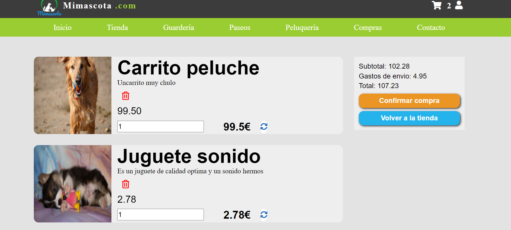

# Shoping cart PHP

---

### Description
A full working shoping cart made only using HTML, CSS, PHP and SQL. Full app working on shoping, search, filter and paginate products. Manage address for shipping and database storage.
Also control of login and register users and an admin site with CRUD for products, users and employees.

---

## Use

To run a PHP application php and a local server its needed.
With Xampp:
- only need to install PHP and SQL with sqlmyadmin. 
- Paste the project folder into htdocs folders inside the xampp folder. 
- Create a database called tiendaphp, run the sql sentence inside the file BBDD/tiendaphp.sql.
- run apache and sql server
- Open http://localhost/php-tienda/tienda.php

---

## Technologies

- HTML CSS
- PHP
- SQL

---
## Author Info

- Linkedin - [Federico Andrés Jácome Castañeda](https://www.linkedin.com/in/federicojacome/)
- Website - [To be added](https://github.com/federocky)

[Back To The Top](#read-me-template)
